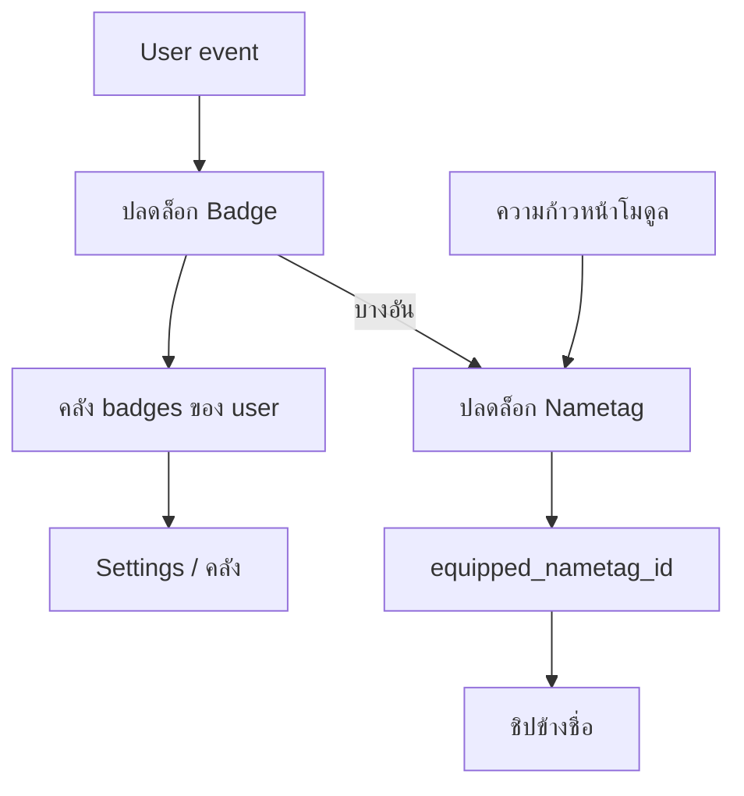

# LUNAR — Badges (design draft)

ไอเดียระบบ badge สำหรับกระตุ้นการเรียนรู้และสะสมตัวตนนักสำรวจบน Lunar  
ยังไม่ใช่สเปก implement — เป็นรายการชื่อ + เงื่อนไขปลดล็อกเพื่อออกแบบต่อ

อ้างอิง product: [concept.md](concept.md) · [functional-spec.md](functional-spec.md)

---

## หลักการตั้งชื่อ

| แนว | ตัวอย่างความรู้สึก |
|------|-------------------|
| คำศัพท์วงโคจร / ภารกิจ | LEO, eclipse, downlink, fairing |
| น้ำเสียงนักสำรวจ ไม่เกมล้วน ๆ | ไม่ใช้ “Level 5” / “Pro Player” |
| ชื่อสั้น อ่านแล้วจำได้ | 1–3 คำต่อ badge |
| มี `id` อังกฤษคงที่ + ชื่อแสดงไทย | แยก logic กับ UI |

**แสดงผลที่วางไว้ (อนาคต):** Settings / โปรไฟล์ · sidebar เล็ก ๆ · หลังปลดล็อก toast สั้น ๆ

---

## Nametag กับ Badge — แยกบทบาทให้ชัด

ตอนนี้ sidebar โชว์ชิป **Adventurer** ค้างใต้ชื่อ — นั่นคือต้นแบบของ **nametag** ไม่ใช่ badge

| | **Nametag** (แท็กข้างชื่อ) | **Badge** (เครื่องหมายสะสม) |
|--|---------------------------|------------------------------|
| หน้าที่ | บอก “ตอนนี้คุณเป็นใครบน Lunar” ในที่แคบ | บอก “คุณทำอะไรมาแล้วบ้าง” |
| จำนวนที่โชว์ | **อย่างมาก 1** ข้างชื่อ | หลายอันในคลัง / แถวเล็ก |
| ผู้ใช้เลือกเองได้ไหม | ได้ (จากชุดที่ปลดแล้ว) | สะสมอัตโนมัติ; อาจเลือก “featured” ทีหลัง |
| ความถี่เปลี่ยน | นาน ๆ ครั้ง (ตัวตน) | บ่อยเมื่อทำภารกิจ |
| ตัวอย่าง | Adventurer → Orbit Cadet → Bus Engineer | First Burn, Eclipse Ready, LAIKA Contact |

### กติกาแสดงผลที่แนะนำ

```
[ avatar ]  Hello, {display_name}
            [{nametag}]              ← ชิปเดียว
```

- **Nametag** อยู่ใต้ชื่อใน sidebar / หัวโปรไฟล์เท่านั้น — ไม่กองหลายชิปรอบชื่อ
- **Badge** ไม่โชว์ทั้งชุดข้างชื่อ — โชว์ใน Settings → ส่วน Badges, หรือแถบไอคอนเล็กใต้ nametag สูงสุด 3 อัน (featured) ถ้ายืดทีหลัง
- **อย่าผสมกับ `role` (learner/admin)** — RBAC เป็นสิทธิ์ระบบ; nametag เป็นตัวตนการเรียนรู้

### ความสัมพันธ์ข้อมูล (แนะนำ)



1. **Badge เป็นของสะสม** — ได้แล้วเก็บในคลังเสมอ  
2. **Nametag เป็นสล็อตสวมใส่** — มีรายการที่ปลดแล้ว + เลือก `equipped` ได้หนึ่งอัน  
3. **ทางปลด nametag** ทำได้สองแบบ (เลือกอย่างใดอย่างหนึ่งหรือผสม):
   - **จาก badge:** เช่น ได้ `full-bus` → ปลด nametag `Bus Engineer`
   - **จาก rank เส้นทาง:** เช่น จบ Space course → เลื่อนชุด rank อัตโนมัติ (ไม่ต้องผูก badge ทีละอัน)

แนะนำ **ผสมแบบบาง**: มีชุด **rank nametag** ตามเส้นทางหลัก + **title nametag** พิเศษจาก badge หายาก (`signal` / `mythic`) ให้เลือกสวมแทนได้

### ชุด Nametag เริ่มต้น (ร่าง)

| ID | ชื่อชิป | ปลดเมื่อ | โทน |
|----|---------|----------|-----|
| `adventurer` | **Adventurer** | default ตอนสมัคร | จุดเริ่ม (ของเดิมใน UI) |
| `orbit-cadet` | **Orbit Cadet** | ได้ `hatch-open` หรือเปิด Space ครั้งแรก | เริ่มเรียน |
| `pad-trainee` | **Pad Trainee** | ได้ `first-burn` | เริ่ม Arena |
| `bus-engineer` | **Bus Engineer** | ได้ `full-bus` | รู้ระบบ CubeSat |
| `range-operator` | **Range Operator** | ได้ `range-safety` | ผ่านหลายด่าน |
| `idea-pilot` | **Idea Pilot** | ได้ `laika-contact` + มี Studio collection | คุย LAIKA / สร้างไอเดีย |
| `full-stack` | **Full-Stack Sat** | ได้ badge `full-stack-sat` | ครบวงจร — title พิเศษ |

Default ที่สวม: `adventurer` จนกว่าจะเลือกเอง หรือ (ทางเลือก product) auto-equip ขั้นสูงสุดของ **rank line** แต่ไม่ auto ทับ title พิเศษที่ user เลือกไว้

### UX ใน Settings (แนะนำ layout)

1. **โปรไฟล์** — ชื่อ, รูป, email  
2. **Nametag** — รายการที่ปลดแล้วเป็นชิปเลือกได้หนึ่งอัน (preview ข้างชื่อ)  
3. **Badges** — กริดคลัง (ล็อก = เงา / ปลดแล้ว = สีเต็ม); แตะดูเงื่อนไข  
4. รหัสผ่าน / เชื่อมระบบอื่น — ตามที่มี

Toast ตอนปลด: สั้น เช่น `ปลด Badge · First Burn` และถ้าได้ nametag ใหม่ด้วย: `ปลด Nametag · Pad Trainee`

### สิ่งที่ควรเลี่ยง

- โชว์ 5–10 ชิปรอบชื่อ (อ่านไม่ออก + เกมเกินไป)  
- ใช้ nametag แทน RBAC หรือกลับกัน  
- ให้ทุก badge เป็น nametag ได้หมด (ชิปจะรกและไม่มีความหมาย)  
- บังคับเก็บ streak บนชิปชื่อ (เอาไปไว้ใน badge / สถิติแยก)

---

## ชั้นความหายาก

| Tier | ความหมาย | สัดส่วนโดยประมาณ |
|------|----------|------------------|
| `common` | เกือบทุกคนได้เมื่อเริ่มใช้จริง | เยอะ |
| `rare` | ต้องทุ่มเทในโมดูลใดโมดูลหนึ่ง | ปานกลาง |
| `signal` | ครอสโมดูล / ความต่อเนื่อง | น้อย |
| `mythic` | หายากจริง หรือ event พิเศษ | น้อยมาก |

---

## Catalog — ชุดแรกที่แนะนำ

### A. บัญชี & ตัวตน

| ID | ชื่อแสดง | Tier | เงื่อนไขปลดล็อก |
|----|----------|------|-----------------|
| `first-light` | **First Light** · แสงแรก | common | สมัคร / เข้าสู่ระบบครั้งแรกสำเร็จ |
| `callsign` | **Callsign** · สัญญาณเรียก | common | ตั้ง `display_name` ใน Settings |
| `visage` | **Visage** · ใบหน้าภารกิจ | common | อัปโหลดรูปโปรไฟล์ (local avatar) |
| `twin-orbit` | **Twin Orbit** · วงโคจรคู่ | rare | เชื่อมบัญชี Google สำเร็จ |

### B. Space — Learn

| ID | ชื่อแสดง | Tier | เงื่อนไขปลดล็อก |
|----|----------|------|-----------------|
| `hatch-open` | **Hatch Open** · เปิดฝา | common | เปิด course แรกใน Space |
| `bus-walker` | **Bus Walker** · เดินในบัส | rare | จบโมดูล Anatomy (หรือเทียบเท่า “รู้จักชิ้นส่วน”) |
| `eclipse-ready` | **Eclipse Ready** · พร้อมคราส | rare | จบโมดูล Physics |
| `autopilot-ink` | **Autopilot Ink** · หมึกออโตไพลอต | rare | จบโมดูล Programming |
| `full-bus` | **Full Bus** · บัสครบระบบ | signal | จบครบทุกโมดูลใน course `cubesat-for-beginner` |
| `pathfinder` | **Pathfinder** · นักวางเส้นทาง | rare | บันทึก / ยืนยัน learning path ใน Space Path |

### C. Arena — Build

| ID | ชื่อแสดง | Tier | เงื่อนไขปลดล็อก |
|----|----------|------|-----------------|
| `pad-clear` | **Pad Clear** · เคลียร์แพด | common | เปิด mission แรกใน Arena |
| `first-burn` | **First Burn** · เผาครั้งแรก | common | ส่ง run แรกของ mission (ไม่จำเป็นต้องผ่าน) |
| `clean-pass` | **Clean Pass** · ผ่านสะอาด | rare | ผ่าน mission อย่างน้อย 1 ด่าน (เกรดผ่าน) |
| `one-orbit` | **One Orbit** · หนึ่งวง | rare | ผ่าน mission ที่เกรดแบบ one-orbit / M01 family |
| `night-side` | **Night Side** · ด้านมืด | rare | ผ่านเกณฑ์ที่เกี่ยวกับ eclipse / power ใน simulation |
| `range-safety` | **Range Safety** · ความปลอดภัยสนามยิง | signal | ผ่าน ≥ 3 missions (หรือครบกิ่ง Space branch หนึ่งกิ่ง) |
| `gold-trace` | **Gold Trace** · รอยทอง | mythic | ผ่าน mission ด้วยคะแนนเต็ม / reference solution เทียบเท่า |

### D. Studio — Launch

| ID | ชื่อแสดง | Tier | เงื่อนไขปลดล็อก |
|----|----------|------|-----------------|
| `sketch-bay` | **Sketch Bay** · อู่ร่าง | common | สร้าง collection แรกใน Studio |
| `laika-contact` | **LAIKA Contact** · สัญญาณ LAIKA | common | ส่งข้อความถึง LAIKA ครั้งแรก |
| `ground-loop` | **Ground Loop** · วงคุยพื้นดิน | rare | มี conversation กับ LAIKA ≥ 5 ข้อความใน collection เดียว |
| `payload-idea` | **Payload Idea** · ไอเดียเพย์โหลด | rare | สร้าง collection ประเภท idea (หรือเทียบเท่า) |
| `mission-dossier` | **Mission Dossier** · แฟ้มภารกิจ | signal | มี ≥ 3 collections ที่อัปเดตแล้ว |

### E. ครอสโมดูล / จังหวะการกลับมา

| ID | ชื่อแสดง | Tier | เงื่อนไขปลดล็อก |
|----|----------|------|-----------------|
| `learn-build` | **Learn → Build** · จากเรียนสู่สร้าง | signal | จบโมดูล Space อย่างน้อย 1 + ผ่าน Arena mission อย่างน้อย 1 |
| `full-stack-sat` | **Full-Stack Sat** · ดาวเทียมครบวงจร | mythic | มี badge จาก Space + Arena + Studio อย่างน้อยอย่างละ 1 tier `rare+` |
| `reentry` | **Reentry** · กลับเข้าชั้นบรรยากาศ | rare | ล็อกอินอีกครั้งหลังห่าง ≥ 7 วัน แล้วทำกิจกรรมอย่างน้อย 1 อย่าง |
| `constellation` | **Constellation** · กลุ่มดาว | mythic | *(อนาคต)* แชร์ / เชิญเพื่อน หรือครบ milestone ชุมชน |

---

## ไอเดียชื่อสำรอง (ยังไม่ล็อกเงื่อนไข)

ใช้เมื่ออยากเพิ่มชุดตาม course / event ใหม่:

| ชื่อ | โทน |
|------|-----|
| **Fairing Away** | ปล่อยฝาครอบ — เริ่มคอร์สยาก |
| **Downlink Clear** | สื่อสารชัด — ส่งงาน / share สำเร็จ |
| **Soft Capture** | จับยึดนุ่ม — แก้ mission หลัง fail หลายครั้งแล้วผ่าน |
| **Sun-Pointing** | หันหาแสง — streak เรียนติดกัน N วัน |
| **Delta-V** | เปลี่ยนทิศ — แก้ learning path ครั้งใหญ่ |
| **Blackout Window** | ช่วงขาดสัญญาณ — ผ่านด่านที่ห้ามผิดพลาดช่วงหนึ่ง |
| **GNC Whisper** | กระซิบนำทาง — ใช้บล็อก control ขั้นสูงใน Arena |
| **Archive Dust** | ฝุ่นหอจดหมายเหตุ — เปิด knowledge / glossary ครบชุดหนึ่ง |
| **Thai LEO** | วงโคจรไทย — สำเร็จเนื้อหาที่ผูก use-case ไทย (เกษตร / disaster ฯลฯ) |

---

## เงื่อนไขปลดล็อก — สรุปกติกา

1. **Idempotent** — ได้ badge ครั้งเดียว; ทำซ้ำไม่ซ้อน
2. **Server-truth** — ปลดล็อกจาก backend ตาม event จริง (จบโมดูล, run ผ่าน, ตั้งชื่อ ฯลฯ) ไม่เชื่อ client อย่างเดียว
3. **ไม่ย้อนถอน** — ยกเว้นกรณี cheat / ลบบัญชี (นอกสโคปตอนนี้)
4. **เงื่อนไขอ่านง่าย** — ข้อความบน UI สั้น; รายละเอียดเทคนิคอยู่ที่ docs / admin
5. **ไม่บังคับครบชุด** — badge เป็นเครื่องหมายความก้าวหน้า ไม่ล็อกเนื้อหาหลัก (ยกเว้นถ้าทีมตั้งใจทำ gate ทีหลัง)

### Event แหล่งข้อมูลที่ผูกได้ตอนนี้

| Event | แหล่งที่เป็นไปได้ |
|-------|-------------------|
| ตั้งชื่อ / รูป / ลิงก์ Google | `users` + Settings APIs |
| จบโมดูล Space | `space` progress APIs |
| Learning path | `space/learning-path` |
| Arena attempt / run ผ่าน | Arena attempt + run results |
| Studio collection / LAIKA | Studio collections + chat |

---

## ชุดแนะนำสำหรับ MVP

เริ่มน้อย อ่าน story ชัด แล้วค่อยขยาย:

1. `first-light`
2. `callsign`
3. `hatch-open`
4. `first-burn`
5. `clean-pass`
6. `sketch-bay`
7. `laika-contact`
8. `learn-build`

---

## นอกสโคป (ตอนนี้)

- Leaderboard สาธารณะ
- Badge ซื้อด้วยเงิน
- Sync จาก Google / แพลตฟอร์มอื่น
- NFT / on-chain

---

## ขั้นถัดไปเมื่อพร้อม implement

1. ตาราง / catalog: `badges`, `nametags`, `user_badges`, `user.equipped_nametag_id`
2. Hook ปลดล็อกหลัง event สำคัญ (progress complete, run pass, patch me, …)
3. `GET /auth/me` ส่ง `equipped_nametag` + (หรือแยก) `GET /me/badges`
4. Sidebar อ่าน nametag จาก API แทนชิป `Adventurer` คงที่
5. Settings: เลือก nametag + คลัง badges + toast ตอนปลดล็อก
